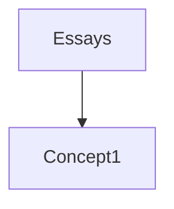

# Content Management

## Source Map

The source map specifies how content is expanded into addressable resources that define the information structure of a project.

Currently only website projects are supported, so the organisation is slightly skewed towards URL-centric representations (this can be tidied up in future in order to represent e-books and print publications).

The source map is made up of a set of expansion policies, listed in the configuration as key-value pairs.

### Configuration Shorthand

The configuration format supports a shorthand for declaring policies based on defaults without needing to provide a specification with every single attribute filled in.

Although it’s not quite implemented this way in Ruby (yet?), you can think of the policy spec in the config as being a union of `String | Symbol | SpecStruct` where all `SpecStruct` attributes are also optional.

The simplest possible config shorthand assumes that the policy label is a plural reference to the collection type that gets expanded.

If the spec value is a symbol, this is interpreted as a singular reference to the entity type that gets attached to the parent collection for each matched content object. In this case, the policy label is overloaded to match the source directory root.

```
content:
  source_map:
    pages: :page
    blog: :post
    gallery: :photo
```

This source map will be interpreted as:

- Expand a `Pages` collection of `Page` objects from the source directory `./pages`
- Expand a `Blog` collection of `Post` objects from the source directory `./blog`
- Expand a `Gallery` collection of `Photo` objects from the source directory `./gallery`

If the spec value is a string, this is interpreted as matching the source directory root for the traversal with the policy label referring to the collection type only and the entity type being a singular conversion of the plural policy label.

```
content:
  source_map:
    pages: "about"
    notes: "archive"
    photos: "gallery"
```

This source map will be interpreted as:

- Expand a `Pages` collection of `Page` objects from the source directory `./about`
- Expand a `Notes` collection of `Note` objects from the source directory `./archive`
- Expand a `Photos` collection of `Photo` objects from the source directory `./gallery`

### Granular Configuration

The shorthand format offers limited possibilities for customisation, so in many situations it’s best to provide a more detailed policy spec. All attributes specified directly take precedence over shorthand conventions and defaults.

```
content:
  source_map:
    site:
      collection: :pages
      entity: :page
      source_path: "about"
    blog:
      entity: :post
      source_path: "archive"
    gallery:
      collection: :photos
```

This will be interpreted as:

- Expand a `Pages` collection of `Page` objects from the source directory `./about`
- Expand a `Blog` collection of `Post` objects from the source directory `./archive`
- Expand a `Photos` collection of `Photo` objects from the source directory `./gallery`

## Expansion Strategies

Each policy specified in the source map triggers a traversal of the source content graph using an event-driven pattern to report each relevant file and directory to an aggregator component which expands these into collections and entity resources.

Changing the aggregator enables a variety of different structures of nested directories and files to be expanded into a well-organised content model, providing a more flexible and creative foundation for publishing and editorial design than the rigid conventions of most other static-site generators.

### Directory Merge

```yml
aggregator: :directory_merge
```

Expands from a list of directories, with each directory representing a single item of content.

This is a good choice for rich-content websites with more complex content layouts for articles or interactive essays where a variety of assets are developed alongside the main manuscript file.

#### Example

Source:

```
🖿 content
└──🖿 essays
   └──🖿 concept-1
      ├──🗎concept-1.md
      ├──🖻image1.png
      ├──🖻image2.svg
      ├──🖻image3.jpg
      ├──🗎data.json
      └──🗎loop.mp3
```

Policy:

```yml
content:
  source_map:
    essays:
      collection: :essays
      aggregator: :directory_merge
      match_source: "essays"
      match_entities: [.md]
      match_assets: [.png, .jpg, .svg, .json, .mp3]
```

Expansion:




```
🗀 essays
└──🗋 essay "concept-1"
   ├──🗅 asset "image1.png"
   ├──🗅 asset "image2.svg"
   ├──🗅 asset "image3.jpg"
   ├──🗅 asset "data.json"
   └──🗅 asset "loop.mp3"
```

### Directory

```
expansion_strategy:
  aggregator: :directory_source
  match_source: "essays"
  match_entities: "*.md"
  match_assets: "*.jpg"
```

## Collection Containers

Some content models may require collection types to be nested children of a top-level parent type. To define this in a policy you can manually specify a `container` which will override the default `collection` at the root level of the content hierarchy. Containers represent ‘collections of collections’, offering more modelling flexibility and applicability to wider variety of website use cases.

```
🖿 content
└──🖿 gallery
   ├──🖿 exhibition-a
   │  ├──🗎1.htm
   │  ├──🗎2.htm
   │  ├──🗎3.htm
   │  ├──🗎a-1.jpg
   │  ├──🗎a-2.jpg
   │  └──🗎a-3.jpg
   └──🖿 exhibition-b
      ├──🗎1.htm
      ├──🗎2.htm
      ├──🗎b-1.jpg
      └──🗎b-2.jpg
```

The following policy spec allows us to model a gallery type which holds a list of exhibitions, with each exhibition in turn holding a list of artworks.

```yml
container: :gallery
collection: :exhibitions
entity: :artwork
```

In many cases it might be fine to just nest instances of a single collection type, but this more fine-grained content modelling can be useful when it comes to templating and editorial design.